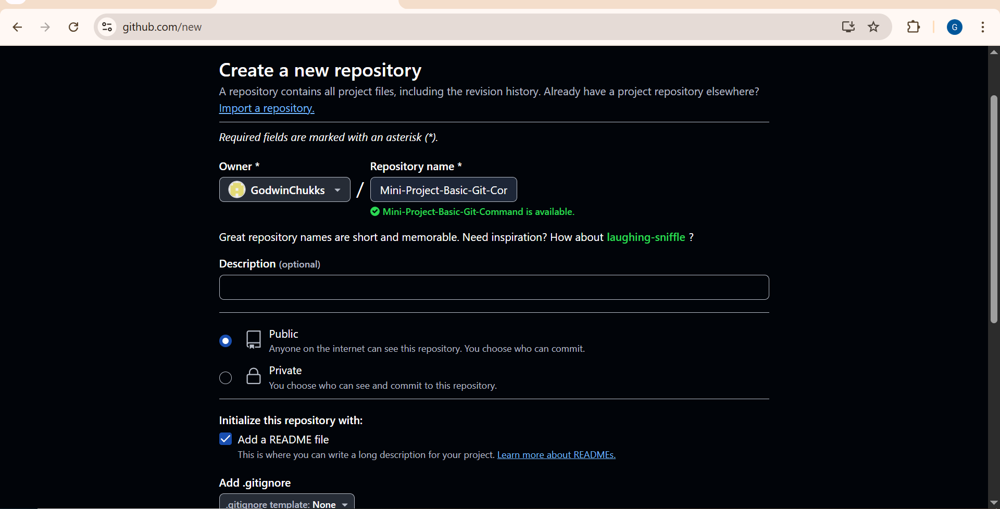
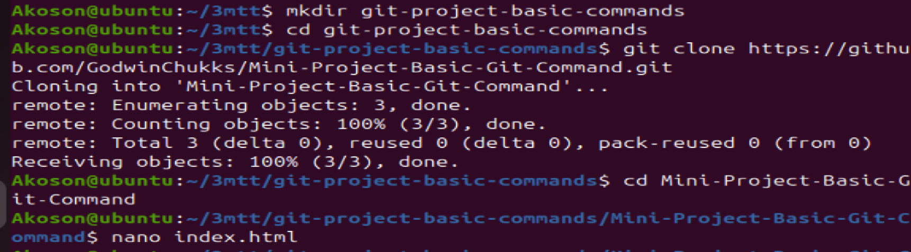
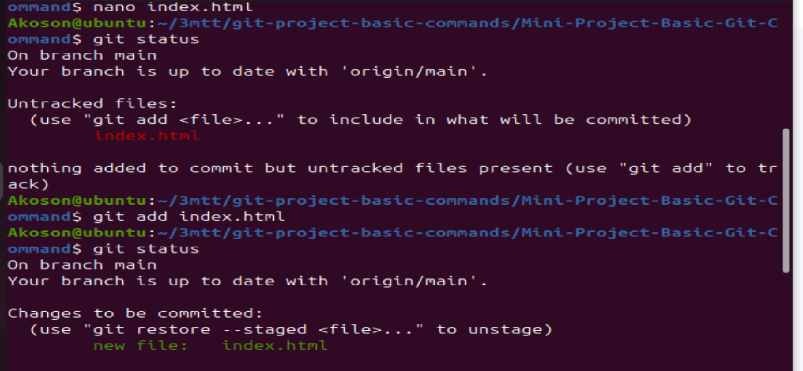
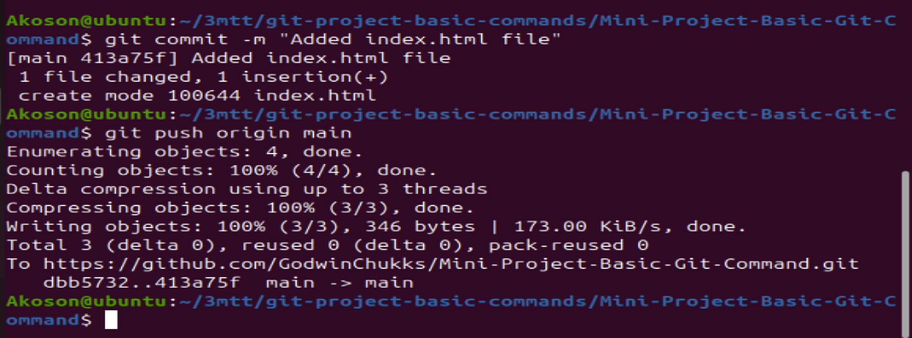
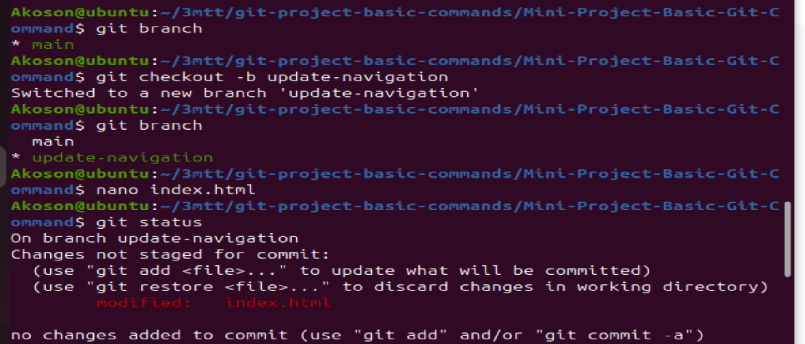
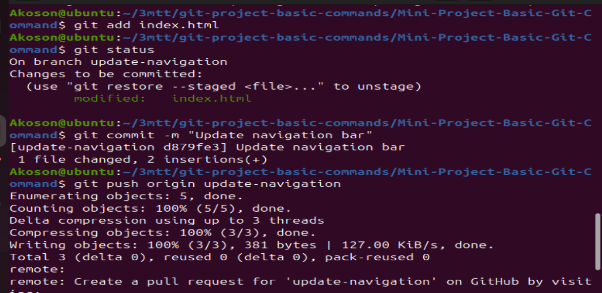
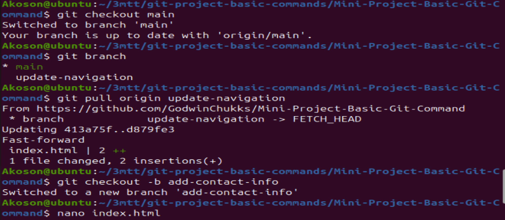
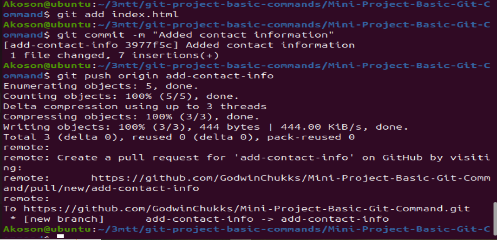
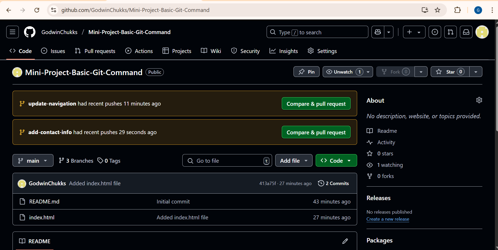

# Mini-Project-Basic-Git-Command

## Git repository setup

## Git basic commands

## Git cloning

## Git Repository initialization

## git commit and git push command

## Tom Branch Workflow

Jerry Branch Workflow

Git Repository Dashboard

